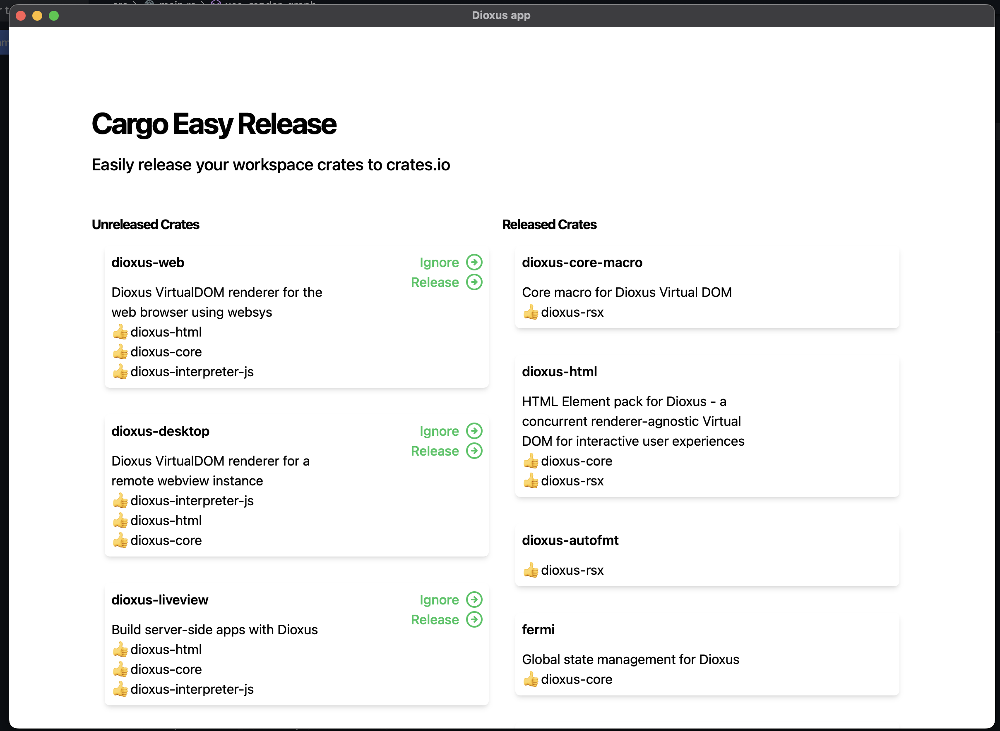

# Easy-Release: a visual tool for releasing workspaces of libraries

A work-in-progress GUI for releasing a large workspace of crates manually, but easily.

Features (work in progress):
- List dependencies and ensure deps are up to date before releasing
- Autodetect semver semantics
- Ensure every crate has proper fields configured before upload
- Ensure versions are up to date
- Ignore no-publish crates
- Automatically sort release list in order of dependency chain (release core libraries first)

## Screenshot

